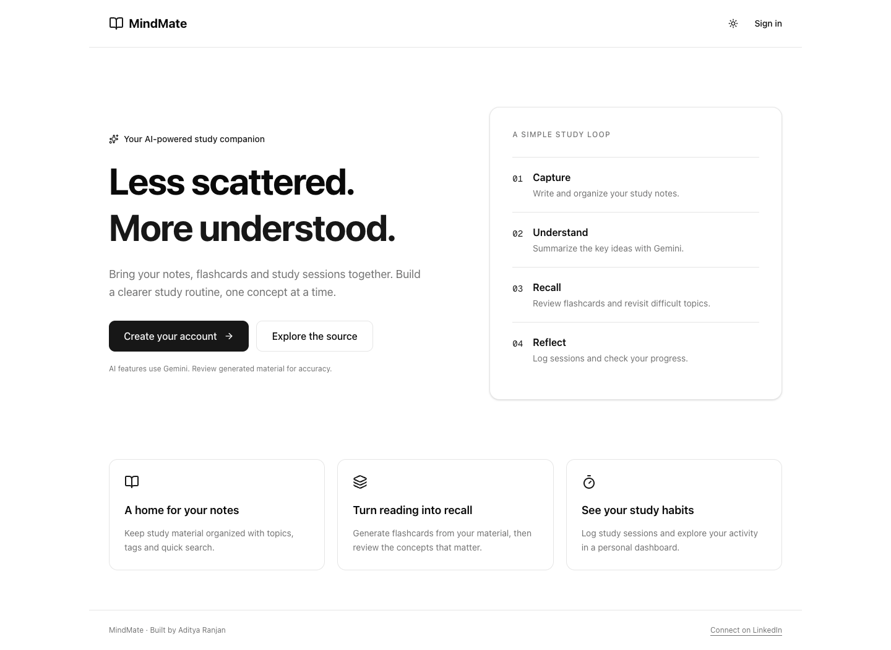

# MindMate

An AI-powered study companion built with Next.js and PostgreSQL. Keep notes, turn study material into summaries and flashcards, review cards, and track study sessions in one workspace.

[](https://github.com/kvianAR/mindmate/actions/workflows/ci.yml)

[Quick start](#quick-start) · [Architecture](#architecture) · [API](#api-overview) · [Limitations](#limitations) · [Contributing](CONTRIBUTING.md)

## Preview



Actual screenshot of the locally running app. A landing page screenshot does not demonstrate database or AI availability on a hosted deployment.

## Features

- Account signup and login with hashed passwords and signed JWTs.
- Notes with search, topics, sorting and pagination.
- Gemini summaries and flashcards from supplied study content.
- Flashcard review with difficulty and review counts.
- Study session logging and progress analytics.
- Light and dark themes.

## Stack

| Layer | Technology |
| --- | --- |
| App & API | Next.js 16, React 19, JavaScript |
| UI | Tailwind CSS 4, shadcn/ui, Lucide |
| Database | PostgreSQL, Prisma 6 |
| Authentication | bcryptjs, jsonwebtoken (HS256) |
| AI | Google Gemini API |

Exact versions are recorded in `package-lock.json`. Use Node.js 22 LTS (`.nvmrc`).

## Quick start

You need Node.js 22, npm, and a running PostgreSQL database. A Gemini key is needed for AI features; ordinary account and notes features do not require it.

```bash
git clone https://github.com/kvianAR/mindmate.git
cd mindmate
npm ci
cp .env.example .env
openssl rand -hex 32
```

Put the generated value in `JWT_SECRET` in `.env`. Set `DATABASE_URL` to your PostgreSQL connection string, and add `GEMINI_API_KEY` if you will use AI features. Keep `.env` local.

```bash
# Generate the client (also runs automatically after npm ci).
npx prisma generate
# Initialize a development database; inspect changes before using this on existing data.
npx prisma db push
npm run dev
```

Open [localhost:3000](http://localhost:3000), create an account and sign in. Create a note before trying the summary feature.

| Variable | Purpose |
| --- | --- |
| `DATABASE_URL` | PostgreSQL connection string |
| `JWT_SECRET` | At least 32 random characters; no default signing key |
| `GEMINI_API_KEY` | Server-side key for summaries, flashcards and recommendations |
| `GEMINI_MODEL` | Optional provider model override; defaults to `gemini-2.5-flash` |

## Architecture

```text
Browser → Next.js API routes → PostgreSQL (Prisma)
                    └──────→ Gemini API (AI features)
```

Protected API routes derive the user ID from a verified token; database queries scope records to that user. Prisma uses one cached client during development rather than opening a new client on every reload.

```text
app/           Pages and API routes
components/    Navigation, protected routes and UI components
contexts/      Authentication and theme state
lib/           Database, AI, auth and request helpers
prisma/        Database schema
tests/         Authentication configuration and input regression tests
node_modules/  Dependencies and generated Prisma client (not committed)
```

## API overview

Authenticated requests use `Authorization: Bearer <token>`.

| Resource | Routes |
| --- | --- |
| Accounts | `POST /api/auth/signup`, `POST /api/auth/login` |
| Notes | `GET/POST /api/notes`, `GET/PUT/DELETE /api/notes/:id` |
| Flashcards | `GET/POST /api/flashcards`, `DELETE /api/flashcards?id=:id`, `PUT /api/flashcards/:id/review` |
| AI | `POST /api/ai/summary`, `POST /api/ai/flashcards` |
| Analytics | `GET /api/analytics?days=30` (1–365 days) |
| Sessions | `GET/POST /api/sessions` |

## Development checks

```bash
npm test
npm run lint
npm run build
npm audit
```

GitHub Actions checks install, lint, regression tests and production build on Node.js 22. Tests cover JWT configuration and tampering, credential validation, password comparison, pagination bounds and AI response validation. They do not exercise a live AI provider.

## Deployment

Deploy as one Next.js application on a compatible host; API routes are part of the same app. Configure all environment variables on the host, provide PostgreSQL, and set the build command to `npm run build` after dependency installation. Prisma generates automatically during install.

For a production database, establish reviewed migration files and a backup process instead of relying on repeated `db push`. A repository build passing does not verify a host's database credentials, Gemini quota or environment settings.

## Limitations

- Tokens are stored in browser local storage; an HTTP-only session design, rate limiting and password reset are future improvements.
- Gemini availability depends on valid credentials, model availability and quota. Review generated study material for accuracy.
- Invalid or unavailable AI responses return an error instead of being replaced by generic placeholder cards.
- Analytics includes up to 100 study sessions in the selected window.
- No database migration history or end-to-end AI test is supplied yet.

## Author and reuse

Built by [Aditya Ranjan](https://github.com/kvianAR). [LinkedIn](https://www.linkedin.com/in/aditya-ranjan-37a827323/).

No license file has been chosen. The earlier README's MIT label did not include a license grant; do not assume an open-source license until a `LICENSE` file is added by the owner.
